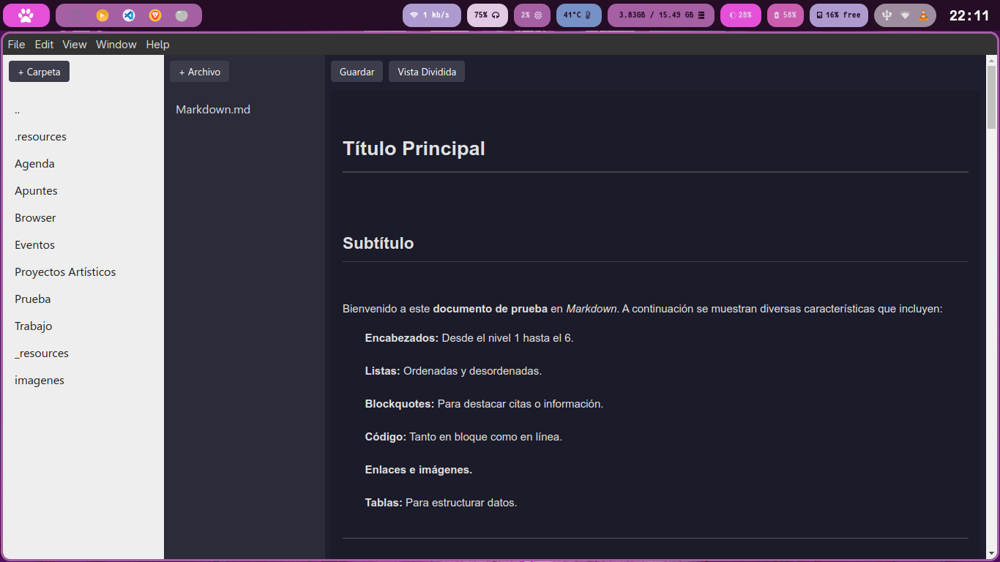
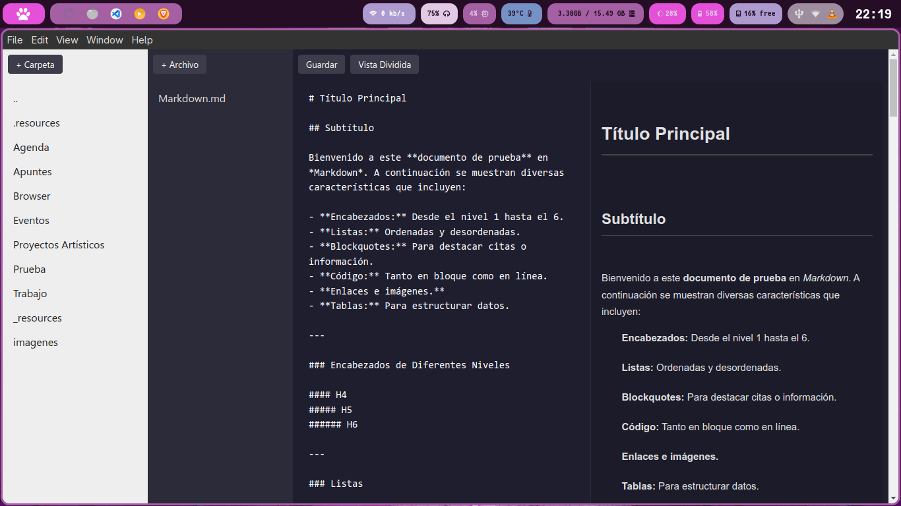
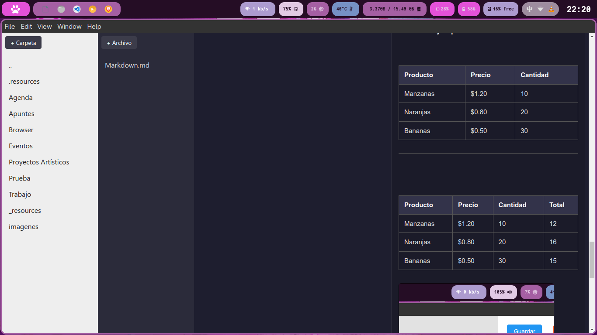

# Markdown Editor

This is only a simple markdown editor, much of the markdown features works (yes, including tables), with a regexp compiler lol. It works as a text editor with a comfortable GUI, no rare formats to save your notes, save it directly in markdown format you can use our editor, or another editor. My editor is comfortable, but you're able to use another, so, it is unfinished.

## Things to do
- Better design
- Add work directory changer to use another root directory, like a netflix user
- Add quick buttons to add markdown elements
- Add svg editor to add handrawing images

## Some screenshots

