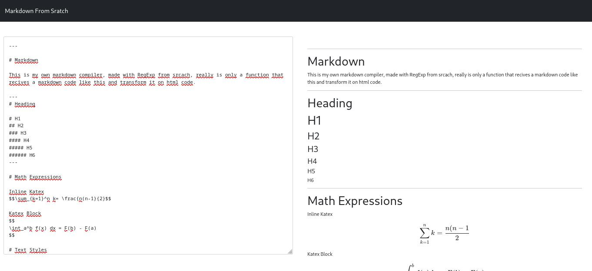

# Markdown Parser inside Browser

This is a little but powerfull markdown to html parser but i is only 1 function that uses a markdown code and transform it into html code. Now it works only on a browser but coming son i will traslate that to Reacto or another modern tecnology.

